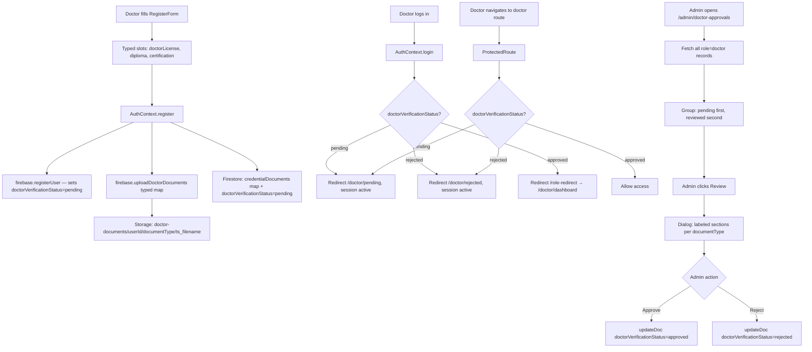

# Design Document: Doctor Verification Workflow

## Overview

This feature replaces the current ad-hoc doctor approval mechanism with a structured, end-to-end verification workflow. The existing system uses a generic file upload, a flat `approvalStatus` field, and silently logs out pending/rejected doctors. The new design introduces typed credential document slots, a `doctorVerificationStatus` field, dedicated holding pages for pending and rejected doctors, and an improved admin review panel with per-type document sections.

The four areas of change are:
1. **Registration** — typed credential upload (doctorLicense, diploma, certification)
2. **Post-login routing** — pending/rejected doctors are kept logged in and redirected to informational pages
3. **Admin panel** — updated to use `doctorVerificationStatus` and show typed document sections
4. **Access control** — ProtectedRoute and RoleRedirectPage enforce status-based routing

### Key Design Decisions

- **Keep sessions active for pending/rejected doctors.** Silently logging them out creates a confusing UX. Instead, they stay authenticated and land on a dedicated page that explains their status.
- **Typed document slots over a generic file list.** Admins need to know which document is which. Keying uploads by `documentType` in both Storage paths and Firestore makes the data self-describing.
- **`doctorVerificationStatus` replaces `approvalStatus` entirely.** A single, unambiguous field name avoids dual-field confusion and makes queries straightforward.
- **`/doctor/pending` and `/doctor/rejected` are semi-public routes.** They require an active Firebase session but do not require `doctorVerificationStatus === "approved"`, so ProtectedRoute must not block them.

---

## Architecture



---

## Components and Interfaces

### RegisterForm (`src/components/auth/RegisterForm.tsx`)

Replaces the single generic file input with three independent typed slots.

```typescript
interface DoctorDocumentSlot {
  key: 'doctorLicense' | 'diploma' | 'certification';
  label: string;
  required: boolean;
  file: File | null;
  error: string | null;
}
```

State shape:
```typescript
const [documentSlots, setDocumentSlots] = useState<DoctorDocumentSlot[]>([
  { key: 'doctorLicense', label: 'Medical License', required: true, file: null, error: null },
  { key: 'diploma',       label: 'Diploma / Degree', required: true, file: null, error: null },
  { key: 'certification', label: 'Additional Certification', required: false, file: null, error: null },
]);
```

Each slot renders independently: its own `<input type="file">`, filename display, remove button, and inline error. Validation runs on submit — if `doctorLicense` or `diploma` is null, submission is blocked and the relevant slot's `error` field is set.

The `register` call passes a typed map:
```typescript
const doctorDocuments = {
  doctorLicense: slots.find(s => s.key === 'doctorLicense')?.file ?? undefined,
  diploma:       slots.find(s => s.key === 'diploma')?.file ?? undefined,
  certification: slots.find(s => s.key === 'certification')?.file ?? undefined,
};
await register(email, password, userData, doctorDocuments);
```

### AuthContext (`src/contexts/AuthContext.tsx`)

The `register` function signature changes to accept a typed documents map:

```typescript
register: (
  email: string,
  password: string,
  userData: any,
  doctorDocuments?: { doctorLicense?: File; diploma?: File; certification?: File }
) => Promise<void>
```

The `login` function replaces `approvalStatus` checks with `doctorVerificationStatus`:

```typescript
// Before (removed):
if (freshUserData?.approvalStatus === 'pending') { await logoutUser(); ... }

// After:
if (freshUserData?.role === 'doctor') {
  if (freshUserData?.doctorVerificationStatus === 'pending') {
    navigate('/doctor/pending'); return;
  }
  if (freshUserData?.doctorVerificationStatus === 'rejected') {
    navigate('/doctor/rejected'); return;
  }
}
```

Session is NOT terminated for pending/rejected doctors.

### firebase.ts (`src/lib/firebase.ts`)

`uploadDoctorDocuments` new signature:

```typescript
export const uploadDoctorDocuments = async (
  userId: string,
  documents: { doctorLicense?: File; diploma?: File; certification?: File }
): Promise<{ doctorLicense?: string; diploma?: string; certification?: string }> => {
  const urls: Record<string, string> = {};
  for (const [documentType, file] of Object.entries(documents)) {
    if (!file) continue;
    const storageRef = ref(
      storage,
      `doctor-documents/${userId}/${documentType}/${Date.now()}_${file.name}`
    );
    await uploadBytes(storageRef, file);
    urls[documentType] = await getDownloadURL(storageRef);
  }
  return urls;
};
```

`registerUser` replaces `approvalStatus` with `doctorVerificationStatus`:

```typescript
const doctorVerificationStatus = userRole === 'doctor' ? 'pending' : undefined;
await setDoc(doc(db, 'users', user.uid), {
  ...userData,
  role: userRole,
  ...(doctorVerificationStatus ? { doctorVerificationStatus } : {}),
  createdAt: Timestamp.now(),
  email,
});
```

### ProtectedRoute (`src/components/auth/ProtectedRoute.tsx`)

Adds a status check for doctor routes. The `/doctor/pending` and `/doctor/rejected` routes must NOT be wrapped in `ProtectedRoute allowedRoles={["doctor"]}` — they are accessible to any authenticated user with role `doctor` regardless of verification status.

For all other doctor routes, the check is:

```typescript
if (userData?.role === 'doctor' && allowedRoles?.includes('doctor')) {
  if (userData?.doctorVerificationStatus === 'pending') {
    return <Navigate to="/doctor/pending" replace />;
  }
  if (userData?.doctorVerificationStatus === 'rejected') {
    return <Navigate to="/doctor/rejected" replace />;
  }
}
```

### RoleRedirectPage (`src/pages/RoleRedirectPage.tsx`)

The `doctor` case is expanded to check `doctorVerificationStatus`:

```typescript
case 'doctor':
  const status = userData.doctorVerificationStatus;
  if (status === 'pending') {
    navigate('/doctor/pending');
  } else if (status === 'rejected') {
    navigate('/doctor/rejected');
  } else {
    navigate('/doctor/dashboard');
  }
  break;
```

No reference to `approvalStatus`.

### PendingApproval page (`src/pages/doctor/PendingApproval.tsx`)

New page at route `/doctor/pending`. Accessible to any authenticated doctor (no `doctorVerificationStatus` gate). Displays:
- Status icon and heading ("Your application is under review")
- Body text explaining the review timeline (up to 3–5 business days) and notification promise
- Logout button that calls `logout()` from AuthContext

### RejectedApplication page (`src/pages/doctor/RejectedApplication.tsx`)

New page at route `/doctor/rejected`. Accessible to any authenticated doctor. Displays:
- Status icon and heading ("Application not approved")
- Body text explaining the decision and next steps
- Support contact link / email
- Logout button

### DoctorApprovals admin page (`src/pages/admin/DoctorApprovals.tsx`)

Updated interface:

```typescript
interface DoctorRecord {
  id: string;
  name: string;
  email: string;
  doctorVerificationStatus: 'pending' | 'approved' | 'rejected';
  credentialDocuments?: {
    doctorLicense?: string;
    diploma?: string;
    certification?: string;
  };
  createdAt?: any;
}
```

The review dialog renders three labeled sections:

```
Medical License      [link or "Not provided"]
Diploma / Degree     [link or "Not provided"]
Additional Cert.     [link or "Not provided" — optional]
```

All `approvalStatus` references replaced with `doctorVerificationStatus`.

### App.tsx

Two new routes added (no ProtectedRoute role gate — accessible to any authenticated user):

```tsx
<Route path="/doctor/pending"  element={<PendingApproval />} />
<Route path="/doctor/rejected" element={<RejectedApplication />} />
```

The `PublicRoute` component must also be updated to redirect pending/rejected doctors to their respective pages instead of `/doctor/dashboard`.

---

## Email Notification via Firestore `mail` Collection

### Approach

Email sending is handled client-side by writing a document to the Firestore `mail` collection. This is compatible with the [Firebase Extension "Trigger Email from Firestore"](https://extensions.dev/extensions/firebase/firestore-send-email), which watches that collection and dispatches emails via a configured SMTP provider (e.g. SendGrid, Mailgun). No separate backend server is required.

### `sendApprovalEmail` helper (`src/lib/firebase.ts`)

```typescript
export const sendApprovalEmail = async (
  doctorEmail: string,
  doctorName: string,
  status: 'approved' | 'rejected'
): Promise<void> => {
  const subject = status === 'approved'
    ? 'Your CareLink application has been approved'
    : 'Update on your CareLink application';

  const html = status === 'approved'
    ? `<p>Hi ${doctorName},</p>
       <p>Congratulations! Your doctor account on CareLink has been <strong>approved</strong>.</p>
       <p>You can now <a href="${window.location.origin}/login">log in</a> and start providing care.</p>`
    : `<p>Hi ${doctorName},</p>
       <p>Thank you for applying to CareLink. Unfortunately, your application was <strong>not approved</strong> at this time.</p>
       <p>If you have questions, please contact us at <a href="mailto:support@carelink.com">support@carelink.com</a>.</p>`;

  await addDoc(collection(db, 'mail'), {
    to: doctorEmail,
    message: { subject, html },
  });
};
```

### DoctorApprovals — updated `handleApproval`

After the successful `updateDoc` call, `handleApproval` calls `sendApprovalEmail`. Failure is caught and logged but does not affect the approval state:

```typescript
// After updateDoc succeeds:
try {
  await sendApprovalEmail(doctor.email, doctor.name, status);
} catch (emailError) {
  console.warn('Email notification failed (non-blocking):', emailError);
}
```

### Data Model — Firestore `mail` document

```typescript
{
  to: string;           // doctor's email address
  message: {
    subject: string;
    html: string;
  };
}
```

The Firebase Extension picks this up automatically and sends the email. The document is write-only from the client; no read-back is needed.

---

## Data Models

### Firestore `users` document (doctor)

```typescript
{
  uid: string;                    // document ID
  name: string;
  email: string;
  role: 'doctor';
  doctorVerificationStatus: 'pending' | 'approved' | 'rejected';  // replaces approvalStatus
  credentialDocuments: {          // replaces flat string[]
    doctorLicense?: string;       // Firebase Storage download URL
    diploma?: string;
    certification?: string;
  };
  createdAt: Timestamp;
  // approvalStatus field is NOT written
}
```

### Firebase Storage path

```
doctor-documents/{userId}/{documentType}/{timestamp}_{filename}
```

Example:
```
doctor-documents/abc123/doctorLicense/1720000000000_license.pdf
doctor-documents/abc123/diploma/1720000000001_degree.png
```

---

## Correctness Properties

*A property is a characteristic or behavior that should hold true across all valid executions of a system — essentially, a formal statement about what the system should do. Properties serve as the bridge between human-readable specifications and machine-verifiable correctness guarantees.*

### Property 1: Required document validation blocks submission

*For any* doctor registration attempt where either `doctorLicense` or `diploma` is absent, the form submission SHALL be rejected and a validation error SHALL be displayed identifying the missing document.

**Validates: Requirements 1.3**

---

### Property 2: File type validation

*For any* file selected for a document slot, if its MIME type is not one of `application/pdf`, `image/jpeg`, or `image/png`, the slot SHALL reject the file and display an inline error. If the MIME type is one of the allowed types, the file SHALL be accepted.

**Validates: Requirements 1.4**

---

### Property 3: Selected file display

*For any* valid file selected in any document slot, the slot SHALL display the file's name and render a remove button.

**Validates: Requirements 1.5**

---

### Property 4: Storage path includes document type

*For any* typed documents map passed to `uploadDoctorDocuments`, each file SHALL be uploaded to a path matching `doctor-documents/{userId}/{documentType}/{timestamp}_{filename}`, where `{documentType}` is the key from the map.

**Validates: Requirements 1.6, 5.5**

---

### Property 5: credentialDocuments map completeness

*For any* typed documents map provided at registration, the `credentialDocuments` field written to Firestore SHALL contain exactly the keys corresponding to the provided document types, each mapped to its download URL.

**Validates: Requirements 1.7**

---

### Property 6: New doctor record uses doctorVerificationStatus

*For any* doctor registration, the Firestore user record SHALL contain `doctorVerificationStatus: "pending"` and SHALL NOT contain an `approvalStatus` field.

**Validates: Requirements 1.8, 5.3**

---

### Property 7: Pending doctor is redirected on any doctor-only route

*For any* doctor-only route path, a doctor with `doctorVerificationStatus === "pending"` SHALL always be redirected to `/doctor/pending` by ProtectedRoute, regardless of which route they attempt to access.

**Validates: Requirements 2.3**

---

### Property 8: Rejected doctor is redirected on any doctor-only route

*For any* doctor-only route path, a doctor with `doctorVerificationStatus === "rejected"` SHALL always be redirected to `/doctor/rejected` by ProtectedRoute, regardless of which route they attempt to access.

**Validates: Requirements 4.4**

---

### Property 9: Approved doctor is granted access on any doctor-only route

*For any* doctor-only route path, a doctor with `doctorVerificationStatus === "approved"` SHALL be granted access without redirection.

**Validates: Requirements 4.2**

---

### Property 10: Doctor list grouping invariant

*For any* list of doctor records with mixed `doctorVerificationStatus` values, the grouping function SHALL place all `pending` records before all non-pending records.

**Validates: Requirements 3.1**

---

### Property 11: Doctor list row renders all required fields

*For any* doctor record, the rendered list row SHALL include the doctor's name, email, registration date, `doctorVerificationStatus` badge, and document count.

**Validates: Requirements 3.2**

---

### Property 12: Review dialog renders labeled document sections

*For any* `credentialDocuments` map, the review dialog SHALL render a labeled section for each document type present in the map (`doctorLicense` → "Medical License", `diploma` → "Diploma / Degree", `certification` → "Additional Certification").

**Validates: Requirements 3.3**

---

### Property 13: Failed Firestore update leaves status unchanged

*For any* doctor and any Firestore failure during an approval or rejection action, the doctor's displayed `doctorVerificationStatus` in the panel SHALL remain unchanged.

**Validates: Requirements 3.6**

---

### Property 14: Non-admin users cannot access admin approvals panel

*For any* user with `role !== "admin"`, attempting to access `/admin/doctor-approvals` SHALL result in a redirect away from that route.

**Validates: Requirements 3.8**

---

### Property 15: RoleRedirectPage routes doctors by doctorVerificationStatus

*For any* `doctorVerificationStatus` value (`pending`, `approved`, `rejected`), the RoleRedirectPage SHALL route the doctor to the correct destination (`/doctor/pending`, `/doctor/dashboard`, `/doctor/rejected` respectively) without reading `approvalStatus`.

**Validates: Requirements 4.5, 5.1**

---

## Error Handling

| Scenario | Handling |
|---|---|
| Required document missing on submit | Inline error on the affected slot; form submission blocked |
| Invalid file MIME type | Inline error on the affected slot; file not added to state |
| Firebase Storage upload failure | Toast error; registration aborted; user prompted to retry |
| Firestore write failure during registration | Toast error; user prompted to retry |
| Firestore update failure during admin approval/rejection | Toast error; local state NOT updated; buttons re-enabled |
| Doctor navigates to doctor route while pending | Silent redirect to `/doctor/pending` (no error toast) |
| Doctor navigates to doctor route while rejected | Silent redirect to `/doctor/rejected` (no error toast) |
| Unauthenticated user accesses `/doctor/pending` or `/doctor/rejected` | Redirect to `/login` |

---

## Testing Strategy

### Unit Tests (example-based)

- `RegisterForm` renders three typed slots when doctor role is selected (Req 1.1)
- `RegisterForm` marks `doctorLicense` and `diploma` as required, `certification` as optional (Req 1.2)
- `AuthContext.login` keeps session active and navigates to `/doctor/pending` for pending doctors (Req 2.1)
- `AuthContext.login` keeps session active and navigates to `/doctor/rejected` for rejected doctors (Req 2.5)
- `PendingApproval` page renders review message and logout button (Req 2.2, 2.4)
- `RejectedApplication` page renders rejection message and support link (Req 2.6)
- Admin panel Approve button calls `updateDoc` with `doctorVerificationStatus: "approved"` and updates local state (Req 3.4)
- Admin panel Reject button calls `updateDoc` with `doctorVerificationStatus: "rejected"` and updates local state (Req 3.5)
- Approve/Reject buttons are disabled while `actionLoading` is true (Req 3.7)
- `RoleRedirectPage` navigates approved doctor to `/doctor/dashboard` (Req 4.1)
- `AuthContext.login` navigates rejected doctor to `/doctor/rejected` with session active (Req 4.3)

### Property-Based Tests

Using [fast-check](https://github.com/dubzzz/fast-check) (TypeScript). Each test runs a minimum of 100 iterations.

- **Property 1** — `fc.record({ doctorLicense: fc.option(fc.constant(mockFile)), diploma: fc.option(fc.constant(mockFile)) })` — verify submission blocked when either required slot is null. `Feature: doctor-verification-workflow, Property 1: required document validation blocks submission`
- **Property 2** — `fc.string()` as MIME type — verify only allowed types are accepted. `Feature: doctor-verification-workflow, Property 2: file type validation`
- **Property 3** — `fc.record({ name: fc.string(), type: fc.constantFrom('application/pdf', 'image/jpeg', 'image/png') })` — verify filename and remove button appear. `Feature: doctor-verification-workflow, Property 3: selected file display`
- **Property 4** — `fc.record({ userId: fc.string(), documentType: fc.constantFrom('doctorLicense', 'diploma', 'certification'), filename: fc.string() })` — verify storage path format. `Feature: doctor-verification-workflow, Property 4: storage path includes document type`
- **Property 5** — `fc.record({ doctorLicense: fc.option(fc.constant(mockFile)), diploma: fc.option(fc.constant(mockFile)), certification: fc.option(fc.constant(mockFile)) })` — verify credentialDocuments map keys match provided types. `Feature: doctor-verification-workflow, Property 5: credentialDocuments map completeness`
- **Property 6** — `fc.record({ name: fc.string(), email: fc.emailAddress() })` as doctor registration data — verify Firestore write contains `doctorVerificationStatus: "pending"` and no `approvalStatus`. `Feature: doctor-verification-workflow, Property 6: new doctor record uses doctorVerificationStatus`
- **Property 7** — `fc.constantFrom(...doctorOnlyRoutes)` — verify pending doctor is redirected to `/doctor/pending`. `Feature: doctor-verification-workflow, Property 7: pending doctor redirected on any doctor-only route`
- **Property 8** — `fc.constantFrom(...doctorOnlyRoutes)` — verify rejected doctor is redirected to `/doctor/rejected`. `Feature: doctor-verification-workflow, Property 8: rejected doctor redirected on any doctor-only route`
- **Property 9** — `fc.constantFrom(...doctorOnlyRoutes)` — verify approved doctor is granted access. `Feature: doctor-verification-workflow, Property 9: approved doctor granted access on any doctor-only route`
- **Property 10** — `fc.array(fc.record({ doctorVerificationStatus: fc.constantFrom('pending', 'approved', 'rejected') }))` — verify grouping places pending first. `Feature: doctor-verification-workflow, Property 10: doctor list grouping invariant`
- **Property 11** — `fc.record({ name: fc.string(), email: fc.emailAddress(), doctorVerificationStatus: fc.constantFrom('pending', 'approved', 'rejected'), credentialDocuments: fc.record({}) })` — verify all required fields appear in rendered row. `Feature: doctor-verification-workflow, Property 11: doctor list row renders all required fields`
- **Property 12** — `fc.record({ doctorLicense: fc.option(fc.string()), diploma: fc.option(fc.string()), certification: fc.option(fc.string()) })` — verify labeled sections match present keys. `Feature: doctor-verification-workflow, Property 12: review dialog renders labeled document sections`
- **Property 13** — any doctor + simulated Firestore rejection — verify local state unchanged. `Feature: doctor-verification-workflow, Property 13: failed Firestore update leaves status unchanged`
- **Property 14** — `fc.constantFrom('patient', 'doctor', 'guest', '')` as role — verify non-admin is redirected from admin route. `Feature: doctor-verification-workflow, Property 14: non-admin users cannot access admin approvals panel`
- **Property 15** — `fc.constantFrom('pending', 'approved', 'rejected')` as doctorVerificationStatus — verify RoleRedirectPage routes correctly without reading approvalStatus. `Feature: doctor-verification-workflow, Property 15: RoleRedirectPage routes doctors by doctorVerificationStatus`

### Integration Tests

- Full registration flow: doctor registers with typed documents → Storage paths are correct → Firestore record has `doctorVerificationStatus: "pending"` and `credentialDocuments` map
- Full approval flow: admin approves doctor → doctor logs in → lands on `/doctor/dashboard`
- Full rejection flow: admin rejects doctor → doctor logs in → lands on `/doctor/rejected` with session active
