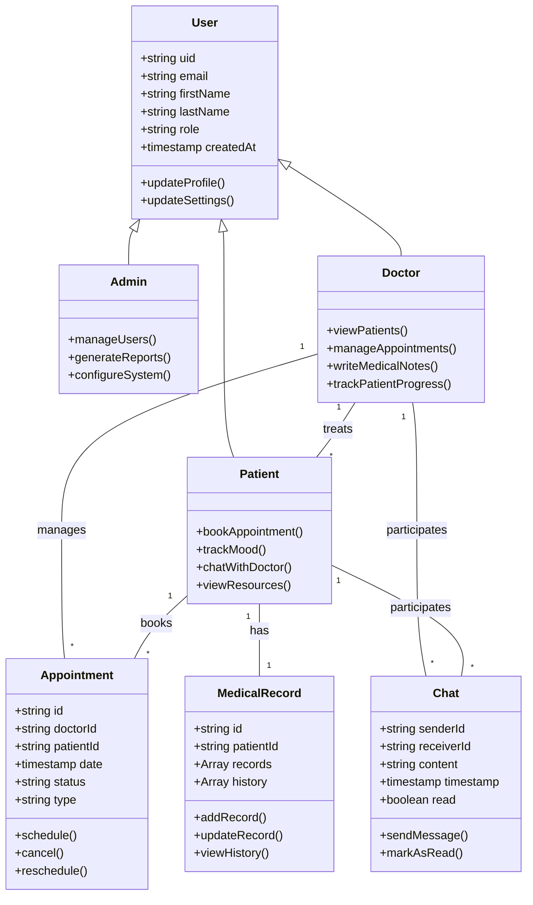
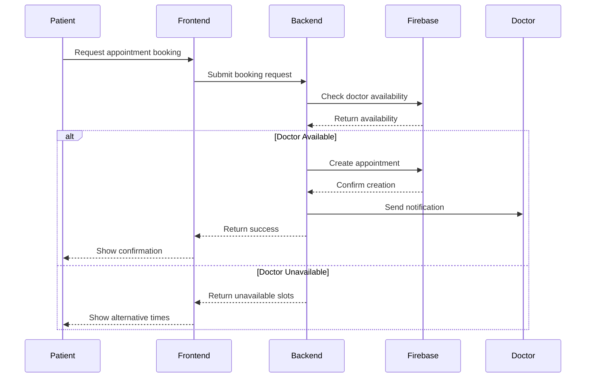
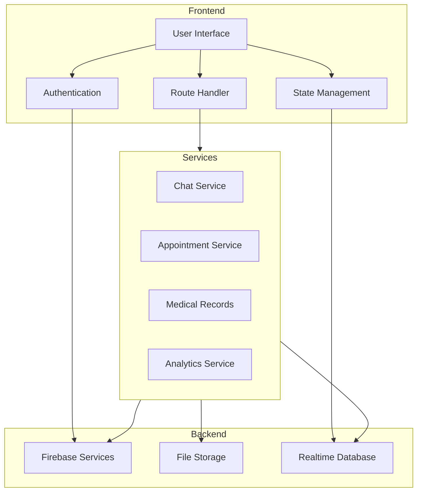
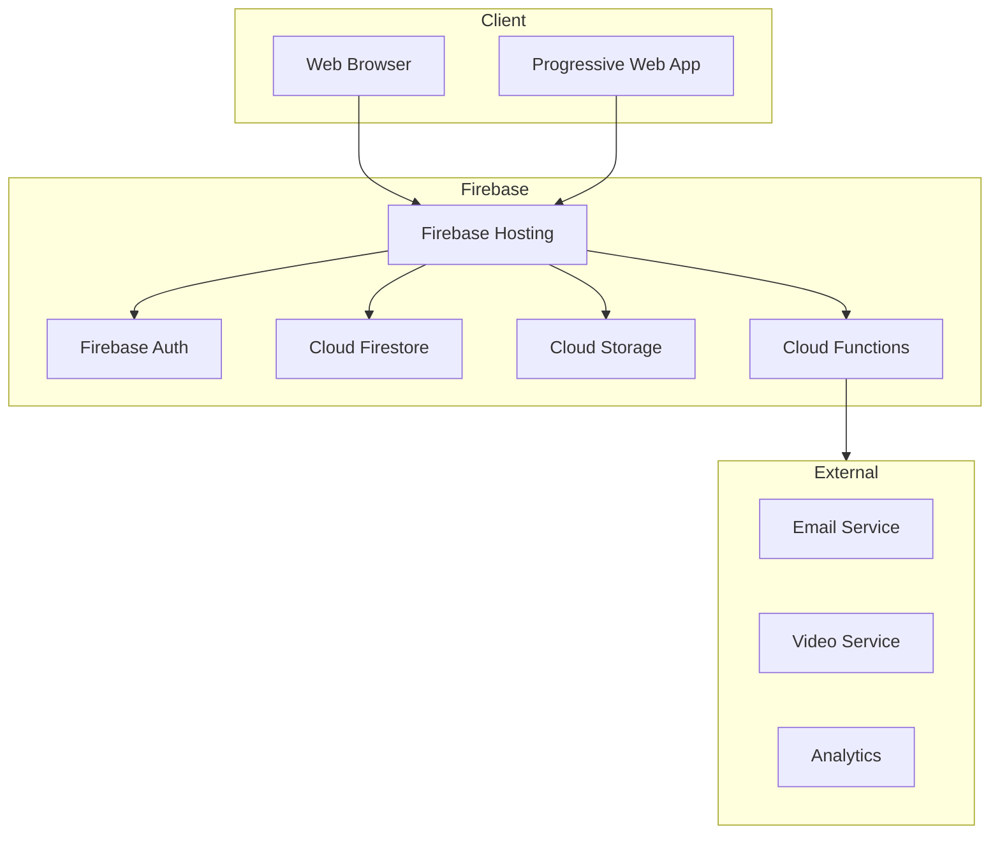

# System Architecture and UML Diagrams

## Class Diagram


## Sequence Diagram - Appointment Booking


## Component Diagram


## Deployment Architecture


## Security Model
```mermaid
graph TB
    subgraph Authentication
        Login[Login]
        Register[Register]
        Reset[Password Reset]
    end

    subgraph Authorization
        Rules[Security Rules]
        RBAC[Role Based Access]
        Claims[Custom Claims]
    end

    subgraph Data Access
        Read[Read Operations]
        Write[Write Operations]
        Delete[Delete Operations]
    end

    Login --> RBAC
    Register --> RBAC
    RBAC --> Rules
    Rules --> Data Access
    Claims --> Rules
```

## System Interactions
1. **User Authentication Flow**
   - Registration/Login
   - Role assignment
   - Session management
   - Security rules enforcement

2. **Appointment Management Flow**
   - Availability check
   - Booking process
   - Notification system
   - Calendar integration

3. **Communication Flow**
   - Real-time chat
   - Video consultations
   - File sharing
   - Notifications

4. **Data Management Flow**
   - Medical records access
   - Progress tracking
   - Report generation
   - Data analytics

## Security Considerations
1. **Data Privacy**
   - End-to-end encryption for chats
   - Secure file storage
   - Role-based access control
   - HIPAA compliance measures

2. **Authentication**
   - Multi-factor authentication
   - Session management
   - Password policies
   - Account recovery

3. **Authorization**
   - Granular permissions
   - Data access rules
   - Action-based restrictions
   - Audit logging